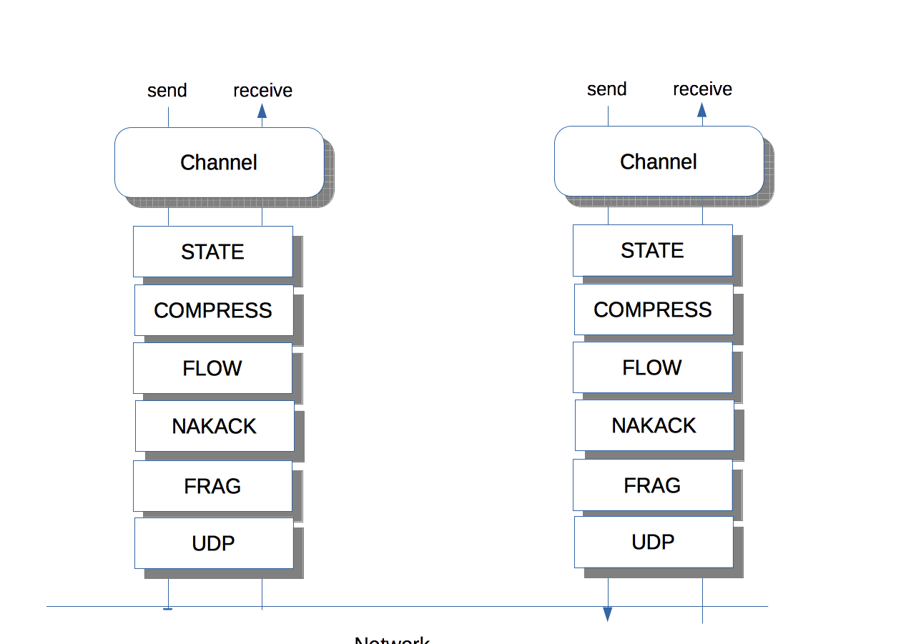

JGroups: reliable group communication in Java
=============================================
:author: Bela Ban belaban@yahoo.com
:backend: deckjs
:deckjs_transition: fade
:navigation:
:deckjs_theme: web-2.0
:deckjs_transition: fade
:goto:
:menu:
:toc:
:status:

About me
--------
* Bela Ban, Kreuzlingen (Switzerland)
* PhD in Zurich, post-doc at Cornell where I started JGroups in 1998
* I've been working on JGroups ever since
* Joined JBoss in 2003 as employee 007
* JBoss was acquired by RedHat in 2006
* Started JBossCache (predecessor of Infinispan) in 2003, worked on it until version 1.4
* Started jgroups-raft end of 2014
* I enjoy biking, mountain biking, tennis, running
* I hate maven, scala, fat monolithic projects, security

What is JGroups?
----------------
* Library (a single 2MB JAR) for _reliable group communication_:
** One-to-many or one-to-one communication in a cluster
** Cluster management (join, leave, membership management)
* Adds reliability to IP multicasting
** Retransmission, deliver-once, FIFO or total ordering
** TCP also supported as transport

When should I use it?
---------------------
* When your application needs to
** discover the nodes of a cluster automatically
** add or remove nodes _dynamically_
** send messages to all (or a subset of) nodes, or to single nodes _reliably_
** rely on all messages arriving in a given order
** get notified when nodes join or leave (or crash)
** customize QoS for cluster communication

Typical applications
--------------------
* Replicated or distributed state (session state in application servers)
* Communication in a cluster
* Chat
* Task distribution
* Presence
* Pub/sub

Other factoids
--------------
* Runs on Android, too
* Largest cluster: 2'238 nodes on Google Compute Engine
* Very stable: `currentYear()-1998` years old

Goals for JGroups
-----------------
* Keep JGroups small, lean & mean and don't lose focus of the scope (reliable group comm)
* I'm happier if I can remove something than if I have to add something
* "A designer knows he has achieved perfection not when there is nothing left to add, but when there is nothing left
   to take away" (Antoine de Saint-Exupery)
* I like KISS
* I'm fighting dependency orgies seen in a lot of projects today
* JGroups has 0 (runtime) dependencies and I want to keep it that way

JGroups has 3 parts
-------------------
. JChannel
* A _cluster node endpoint_. Like a socket

. Protocol stack
* Users can add, remove, replace, enhance, or even write their own protocols
* Ships protocols for
** Network communication (transport)
** Membership discovery
** Failure detection
** Lossless and ordered transmission
** Network split handling and subsequent merging
** Notification when nodes join or leave the cluster (membership)
** Flow control
** Fragmentation
** Compression, encryption, authentication
* Stack can be adapted to every environment

. Building blocks
* Used over a channel
** Method invocation across a cluster
** Distributed caches, counters, locks, task execution

Architecture
------------
* Users deal mainly with the _channel_ (`JChannel`)
* The protocol stack is setup according to an XML config file
* A sent message passes the stack _top-down_
* A received message is passed up through the stack _bottom-up_

JChannel
--------
* Create channel
* Join or leave a cluster
* Receive view updates
* Send / receive messages
* Close the channel

Example 1: disseminating stock updates
--------------------------------------

[source,java]
----
protected static void start(String name) throws Exception {
    JChannel ch=new JChannel("/home/bela/fast.xml").name(name);
    ch.setReceiver(new ReceiverAdapter() {
        public void viewAccepted(View view) {
            System.out.printf("-- view: %s\n", view);
        }
        public void receive(Message msg) {
            Update update=(Update)msg.getObject();
            System.out.printf("%s: %.2f\n", update.name, update.val);
        }

    });
    ch.connect("stock-ticker");
    for(;;) {
        String ticker=stocks[((int)Util.random(stocks.length - 1))];
        ch.send(null, new Update(ticker, Util.random(200)));
        Util.sleep(3000);
    }
}

protected static class Update implements Serializable {
    protected String name;
    protected double val;

    public Update(String name, double val) {this.name=name;this.val=val;}
}
----

Building block: RpcDispatcher
-----------------------------
* Building block to invoke _group methods_ (= methods in all cluster nodes)
* Blocking or non-blocking
* Filtering, response collection, timeouts
* get-all, get-first, get-n
* Handles target crashes

Example 2: updating a shared cache
----------------------------------

[source,java]
-----
public V put(K key, V value) {
    V prev_val=get(key);
    try {
        MethodCall call=new MethodCall(PUT, key, value); // calls _put()
        disp.callRemoteMethods(null, call, call_options);
    }
    catch(Exception e) {
        throw new RuntimeException("put(" + key + ", " + value + ") failed", e);
    }
    return prev_val;
}
-----

[source,java]
----
public V _put(K key, V value) {
    V retval=map.put(key, value);
    return retval;
}
----

Protocol stack
--------------
* 80+ protocols
* Default stack has 16 protocols
* Defined via XML (or programmatically):

[source,xml]
----
<config>
    <UDP mcast_port="${jgroups.udp.mcast_port:45588}" />
    <PING />
    <MERGE3 max_interval="30000"
            min_interval="10000"/>
    <FD_SOCK/>
    <FD_ALL/>
    <pbcast.NAKACK2 xmit_interval="500"/>
    <UNICAST3 xmit_interval="500"/>
    <pbcast.STABLE desired_avg_gossip="50000"
                   max_bytes="4M"/>
    <pbcast.GMS print_local_addr="true" join_timeout="2000"
                view_bundling="true"/>
    <UFC max_credits="2M" min_threshold="0.4"/>
    <MFC max_credits="2M" min_threshold="0.4"/>
    <FRAG2 frag_size="60K"  />
</config>
----

Properties of sample stack
--------------------------
* UDP: transport, sends and receives messages. Performs serialization.
* PING: initial discovery to find members
** ~15 discovery protocols, e.g. multicasting, static list, DB, lookup server, AWS, Google CE, OpenStack, Rackspace etc
* MERGE3: detects network partitions (split brain) and merges the subgroups back into one
* FD_SOCK / FD_ALL: failure detection, detects crashes and asks for removal of crashed members
* NAKACK2 / UNICAST3: reliable, lossless, exactly-once, ordered message delivery
* GMS: group membership, handles joins / leaves / crashes, notifies members
* UFC / MFC: flow control
* FRAG2: fragmentation
* More prots: encryption and authentication, compression, stats, distr locks and counters etc

Advantages of protocol stacks
-----------------------------
* Custom configuration matching requirements and (network) environment
* Remove / add protocols
* Write custom protocols (e.g. extending existing ones)
* Divide-and-conquer: each prot does one thing only, and does it well

Demos
-----

Conclusion
----------
* JGroups is a small-footprint library to write clustered applications
* Very simple API with 6 major methods
* Heavily used in the Java clustering world

Questions?
----------
* Website: http://www.jgroups.org
